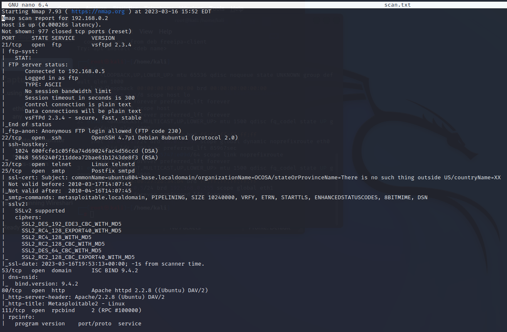
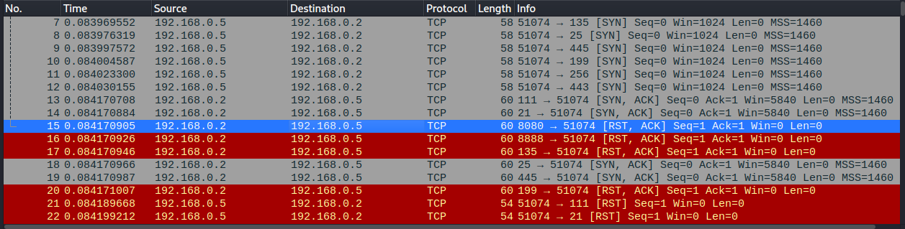
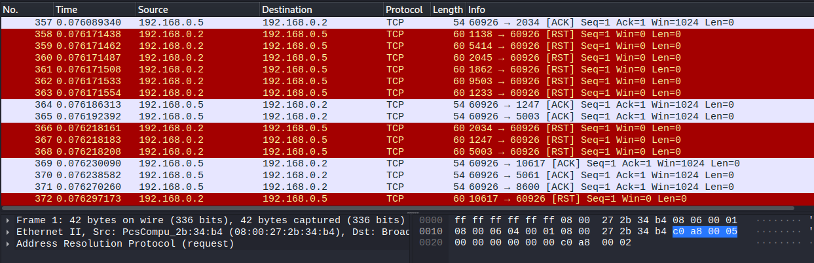
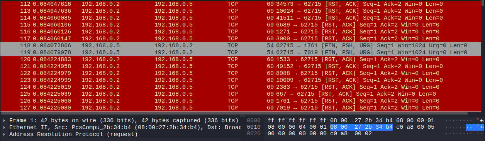
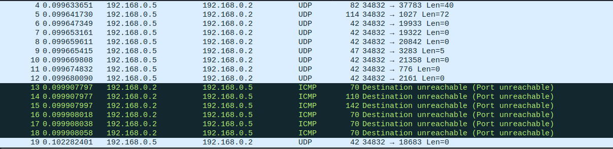

# Домашнее задание к занятию 13.1. «Уязвимости и атаки на информационные системы» - Соловцов Николай

**Домашнее задание выполните в Google Docs или в md-файле в вашем репозитории GitHub.** 

Для оформления вашего решения в GitHub можете воспользоваться [шаблоном](https://github.com/netology-code/sys-pattern-homework).

Название файла Google Docs должно содержать номер лекции и фамилию студента. Пример названия: «13.1. Уязвимости и атаки на информационные системы — Александр Александров».

Перед тем как выслать ссылку, убедитесь, что её содержимое не является приватным, то есть открыто на просмотр всем, у кого есть ссылка. Если необходимо прикрепить дополнительные ссылки, просто добавьте их в свой Google Docs.

Любые вопросы по решению задач задавайте в чате учебной группы.

------

### Задание 1

Скачайте и установите виртуальную машину Metasploitable: https://sourceforge.net/projects/metasploitable/.

Это типовая ОС для экспериментов в области информационной безопасности, с которой следует начать при анализе уязвимостей.

Просканируйте эту виртуальную машину, используя **nmap**.

Попробуйте найти уязвимости, которым подвержена эта виртуальная машина.

Сами уязвимости можно поискать на сайте https://www.exploit-db.com/.

Для этого нужно в поиске ввести название сетевой службы, обнаруженной на атакуемой машине, и выбрать подходящие по версии уязвимости.

Ответьте на следующие вопросы:

- Какие сетевые службы в ней разрешены?
- Какие уязвимости были вами обнаружены? (список со ссылками: достаточно трёх уязвимостей)
  
*Приведите ответ в свободной форме.*  

Ответ:

1. открыт FTP на порту 21/tcp; SSH на порту 22/tcp; telnet на 23/tcp; SMTP на порту 25/tcp; domain 53/tcp; http 80/tcp; postgresql 5432/tcp; vnc 5900/tcp
  x11 6000/tcp; irc 6667/tcp; ajp 8009/tcp; http 8180/tcp и т.д

2. OpenSSL 0.9.8c-1 < 0.9.8g-9 (Debian and Derivatives) - Predictable PRNG Brute Force SSH; Pachev FTP Server 1.0 - Path Traversal; OpenSMTPD - MAIL FROM Remote Code Execution (Metasploit)

### Задание 2

Проведите сканирование Metasploitable в режимах SYN, FIN, Xmas, UDP.

Запишите сеансы сканирования в Wireshark.

Ответьте на следующие вопросы:

- Чем отличаются эти режимы сканирования с точки зрения сетевого трафика?
- Как отвечает сервер?

*Приведите ответ в свободной форме.*

Ответ:

1. SYN идет по протоколу TCP и соединение не устанавливается до конца. FIN и Xmas запросы идут по протоколу TCP и различаются флагами в пакете запросов, 
   UDP посылает пустой заголовок на целевоые порты по UDP и ICMP, проверяя открыт ли порт

2. На SYN сервер отвечает попыткой устновить соединение пакетом SYN, ACK. FIN и Xmas в ответ могут получать RST пакет, свидетельствующий о том, что порт закрыт, отсутвие ответа означает, что
   порт открыт. В UDP сканировании сервер может отвечать ICMP ошибкой, что означает, что порт закрыт, или может ответить UDP пакетом, что говорит о том, что порт открыт.

SYN:

FIN:

Xmas:

UDP:

